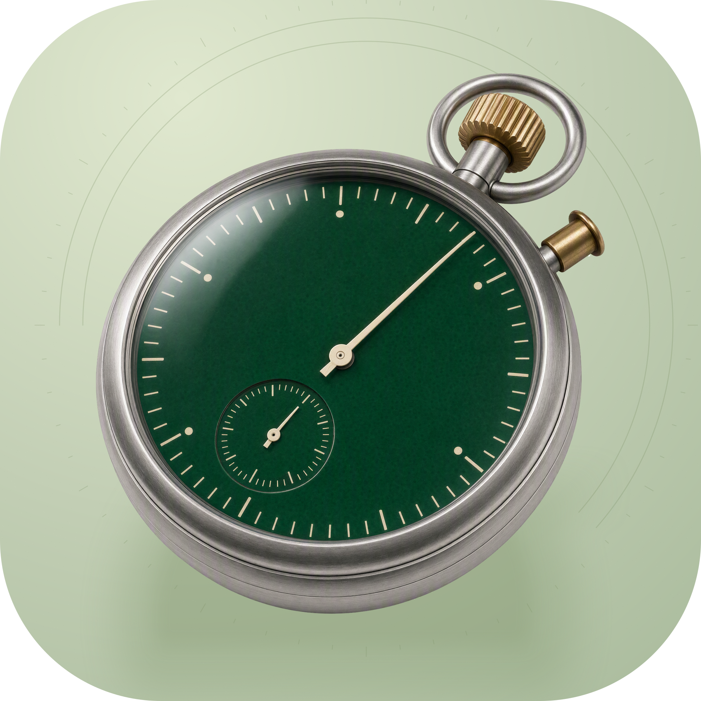

<p align="center">
  
</p>

<h1 align="center">Runner</h1>

<p align="center">在 macOS 上按计划执行本地任务，集中查看运行记录和输出。</p>

<p align="center">
  <a href="docs/README.en.md">English</a>
</p>

## 这是什么

Runner 是面向个人工作流的 macOS 任务调度器。任务可以是 shell 命令、OpenCode prompt 或 HTTP 请求，由 CLI 手动执行，或交给 launchd 定时触发。配套的本地 Dashboard 用于查看任务、运行历史和输出，也能新增和手动触发任务。

它在本机执行命令并保存数据，适合维护自己的定期脚本和 AI 任务。当前 Dashboard 的 API 由 Vite 开发服务提供，没有独立的生产 Web 服务或登录系统。

## 功能

- 按小时、分钟和星期匹配调度规则，支持 `*`、单值、范围、列表及 `*/N` 步长。
- 执行 shell、OpenCode 和 HTTP 任务，支持工作目录与超时设置；执行输出保存为文本文件。
- 用 SQLite 保存运行记录，查看开始时间、退出码、耗时和中断状态。
- 在 Dashboard 查看任务详情、历史、趋势和运行统计，通过文件变化通知更新页面。
- 提供 JSON 查询、任务保存、旧 JSON 数据迁移，以及中断任务检查命令，便于脚本调用。

`auto` 每次只检查当前时间并触发匹配任务，持续调度需要外部定时器。当前时间匹配固定使用 UTC+8；OpenCode prompt 的默认调用使用 `build` agent 和 `zai-coding-plan/glm-4.7`，需要本机已安装 OpenCode 并配置对应模型访问。

## 使用

### 从源码运行

需要 macOS 13+ 和 Swift 6 工具链。HTTP 任务使用系统 `curl`；shell 任务所调用的程序须在运行环境中可用。

```bash
git clone https://github.com/nocoo/runner.git
cd runner
swift build --package-path runner-swift
cp runner-swift/.build/debug/Runner ./runner

./runner init
./runner validate
./runner run sample
./runner logs --list
```

`init` 创建数据目录和一个输出问候语的 shell 示例。任务在后台执行，`run` 返回表示已经启动；最终结果通过 `logs`、`api runs` 或 Dashboard 查看。

| 命令 | 用途 |
| --- | --- |
| `./runner list` | 列出当前任务 |
| `./runner run <task-id>` | 手动执行任务 |
| `./runner auto --dry-run --verbose` | 查看当前时间会触发的任务 |
| `./runner logs <run-id> --tail 30` | 查看一次运行的最后 30 行输出 |
| `./runner api tasks` / `./runner api runs` | 输出 JSON 数据 |
| `./runner monitor` | 检查并标记中断的任务 |
| `./runner cleanup` | 预览过期运行与进程清理计划 |
| `./runner task-save < task.json` | 将单个任务写入 SQLite |
| `./runner migrate --help` | 查看旧 JSON 数据迁移选项 |

默认数据目录为当前工作目录下的 `data/`，可用 `--data-dir <path>` 指定其他目录。`cleanup --force` 才执行清理和进程终止。

### 配置与定时触发

新初始化的数据目录使用 `tasks.json` 和 `schedules.json` 作为初始配置。下面的调度表示在 UTC+8 的工作日 09:00 执行 `sample`：

```json
[
  { "task": "sample", "hour": 9, "minute": 0, "weekday": "1-5" }
]
```

将调度写入 `data/schedules.json` 后运行 `./runner validate`。任务和调度各自优先读取 SQLite 中的启用记录，仅在对应结果为空时回退到 JSON；通过 Dashboard 或 `task-save` 写入任务后，不应假定修改 `tasks.json` 会继续生效。已有 JSON 配置可通过 `./runner migrate --config` 导入，迁移行为见[存储设计记录](docs/06-storage-abstraction.md)。运行记录保存在 `data/runner.db`，输出保存在 `data/runs/<run-id>.output`。

[launchd 配置](launchd/com.runner.scheduler.plist) 是维护者本机的示例，包含绝对路径和指定触发时间。使用前修改二进制、工作目录、日志路径和 `StartCalendarInterval`，使触发时间覆盖自己的调度，再按 macOS LaunchAgent 的方式安装。`auto` 不会补跑未被外部定时器触发的时间点。

## 开发

Dashboard 需要 Bun 和满足 Vite 要求的 Node.js（22.12+）。从仓库根目录执行：

```bash
bun install
cd dashboard
bun install
bun run dev
```

打开 `http://localhost:7008`。先完成上面的 Swift 构建和数据初始化；Dashboard 固定使用仓库根目录的 `runner` 和 `data/`。Swift 源码修改后需重新构建并复制二进制，页面触发任务时才会使用新实现。

在 `dashboard/` 中运行 `bun run build` 构建前端，`bun run typecheck` 和 `bun run lint` 检查类型与代码风格。`preview` 仅预览静态构建，当前 API 插件只在开发服务器启用。Dashboard 的状态概览仍读取 `data/state.json`，与 CLI 的 SQLite 状态查询并非同一读取路径。

```text
runner-swift/    Swift CLI、调度、执行与 SQLite 存储
dashboard/       React 界面和 Vite API 插件
launchd/         本机定时触发配置示例
schemas/         JSON 数据结构
data/           运行数据（本地生成）
docs/           设计、使用记录与英文 README
```

## 测试

完成依赖安装后，从仓库根目录运行：

| 测试层 | 命令 |
| --- | --- |
| Swift 单元测试 | `swift test --package-path runner-swift --no-parallel --skip IntegrationTests` |
| Swift 集成测试 | `swift build --package-path runner-swift && swift test --package-path runner-swift --no-parallel --filter IntegrationTests` |
| Dashboard 单元与组件测试 | `bun run --cwd dashboard test` |

Swift 测试使用 Swift Testing，需要相应的 Xcode 工具链；集成测试在临时目录启动本地 shell 任务并检查 SQLite 与输出文件。Dashboard 使用 Vitest 和 happy-dom，`bun run --cwd dashboard test:watch` 进入监听模式。当前没有单独配置的浏览器端到端测试命令。

## 技术栈


| 部分 | 实现 |
| --- | --- |
| 任务引擎 | Swift、Swift Argument Parser、macOS launchd、Bash |
| 数据存储 | SQLite / GRDB，JSON 配置回退和文本输出 |
| Dashboard | TypeScript、React、React Router、Vite、Tailwind CSS |
| 测试 | Swift Testing、Vitest、React Testing Library、happy-dom |

依赖以 [Package.swift](runner-swift/Package.swift) 和 [Dashboard package.json](dashboard/package.json) 为准。

## 文档

- [英文 README](docs/README.en.md)
- [项目概览](docs/01-overview.md)
- [功能说明](docs/02-features.md)
- [构建与运行](docs/03-quickstart.md)
- [架构与数据流](docs/05-architecture.md)
- [存储迁移设计](docs/06-storage-abstraction.md)
- [Logo 使用](docs/07-logo-usage.md) · [品牌展示](https://hexly.ai/logos/runner)

编号文档保留了实现过程，部分运行时要求和存储阶段描述较早；当前命令与边界以本 README 和源码为准。

## 许可证

仓库目前未包含许可证文件。
