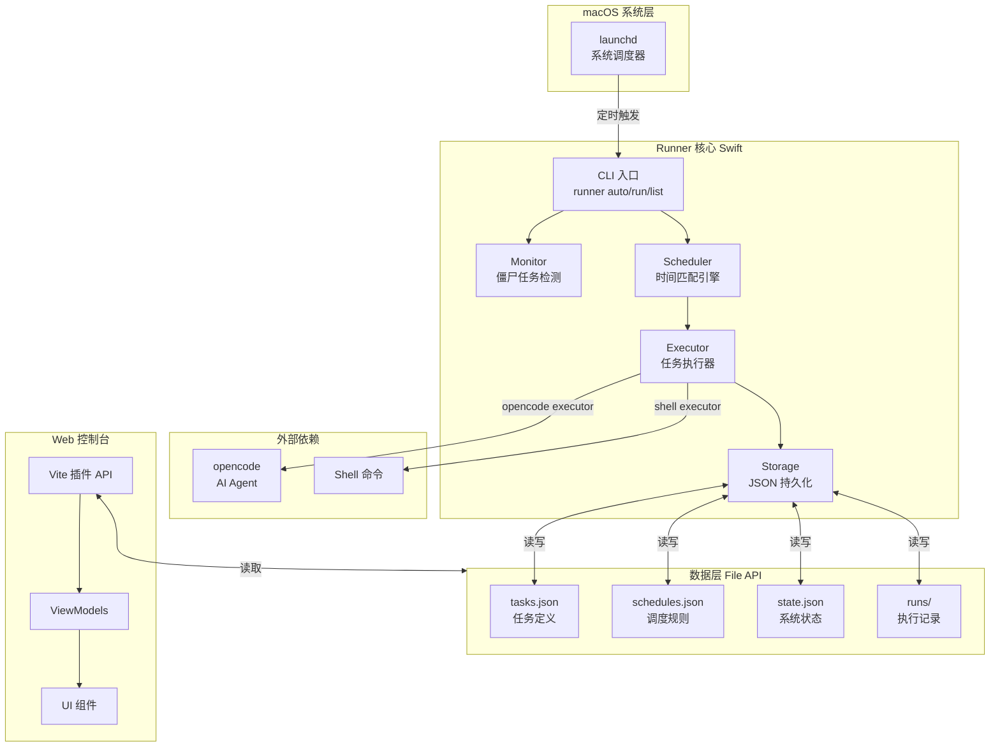

# 05 架构与数据流

## 系统概览



## 目录结构

```
data/
├── tasks.json
├── schedules.json
├── state.json
└── runs/
    ├── index.json
    ├── <uuid>.json
    └── <uuid>.output
```

## 核心组件

- Scheduler：匹配当前时间与 Cron 表达式
- Executor：生成并执行脚本，记录运行结果
- Storage：读取与写入 JSON 数据文件
- Monitor：检查并处理中断的任务
